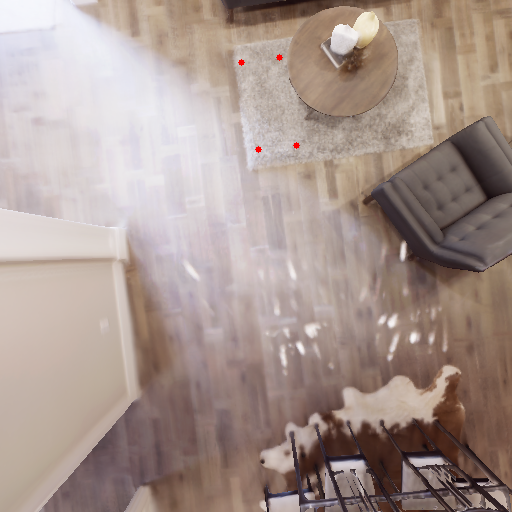
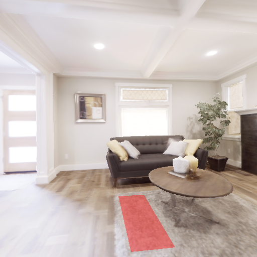
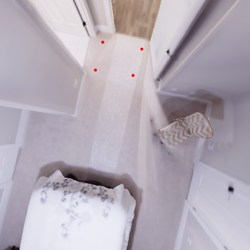
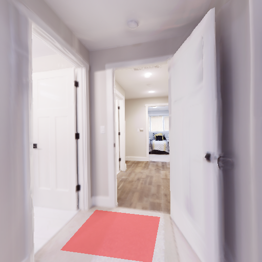
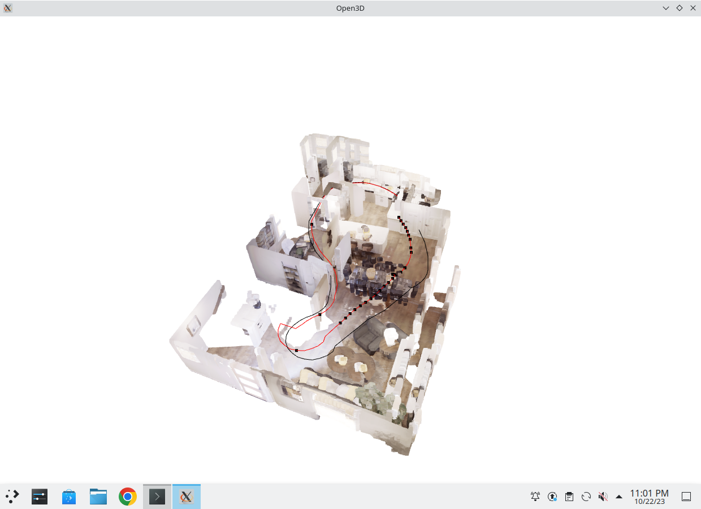
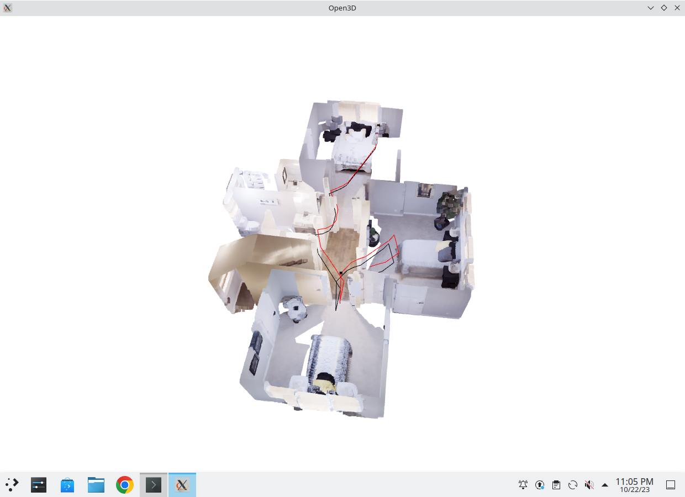
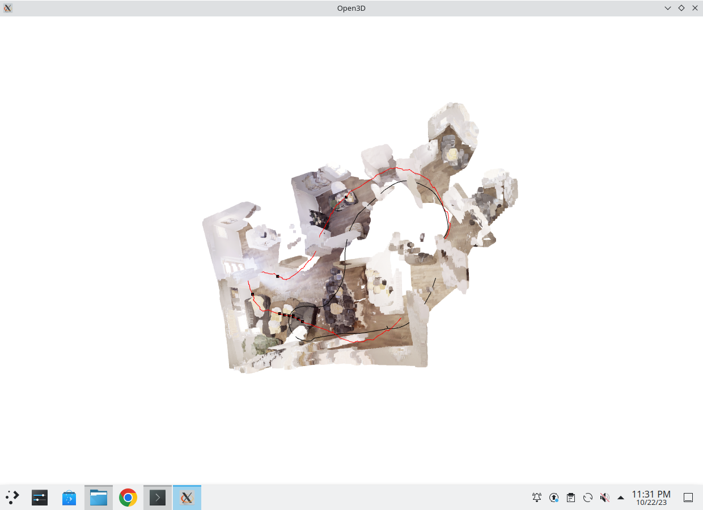
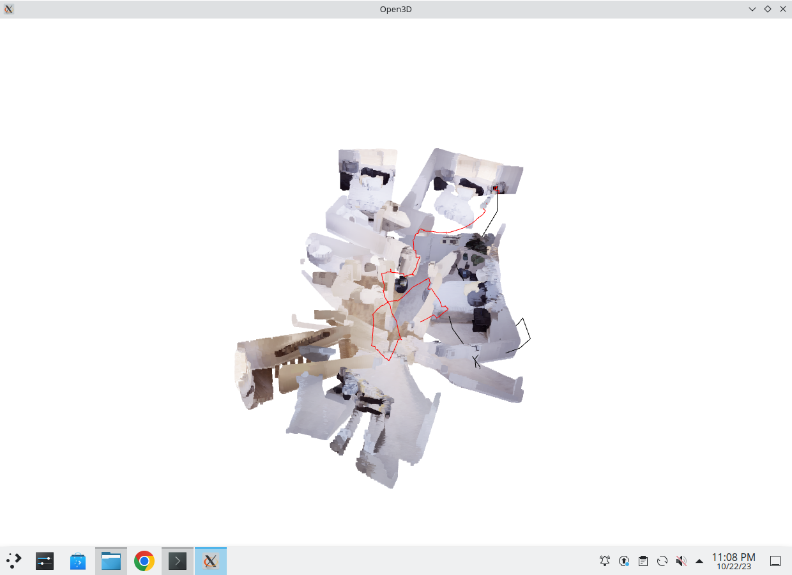

# pdm-f23-hw1

NYCU Perception and Decision Making 2023 Fall

Spec: [Google Docs](https://docs.google.com/document/d/1whwLunr64Q5aqhjNhRfl7udZV4_0wfdZ/edit?usp=sharing&ouid=111927449078729907735&rtpof=true&sd=true)

## Preparation
In your original dpm-f23 directory, `git pull` to get new `hw1` directory.

As for replica dataset, you can use the same one in `hw0`.

---

## Quick start
#### Task1: BEV projection
```
python bev.py
# modify below dir in bev.py to choose floor 1 or 2
    front_rgb = "bev_data/front1.png"
    top_rgb = "bev_data/bev1.png"
```
#### Task2: ICP reconstrution
```
# collect data in habitat simulator
python load.py -f {1, 2}
# reconstruction by icp alogorithm
python reconstruction.py -f {1, 2} -v {my_icp, open3d}
```
---
## Results
#### Task1





#### Task2
**open3d ICP**

 


**my ICP**




* Please star or tag, if you refer my implementations.