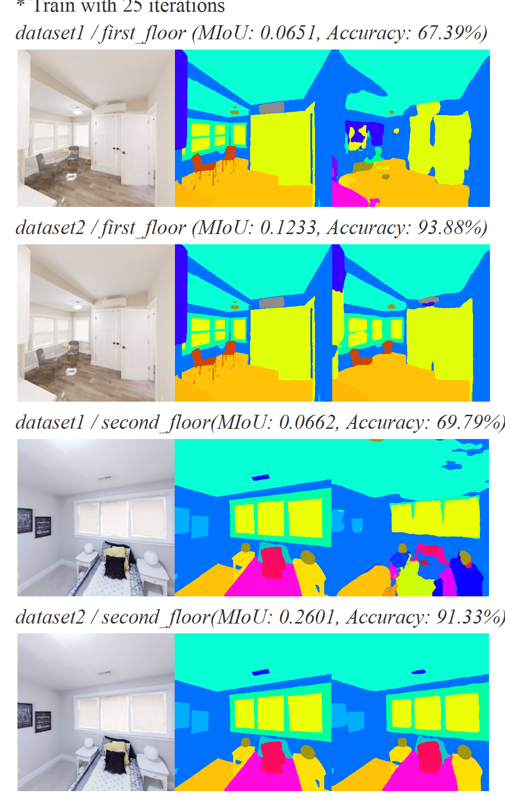
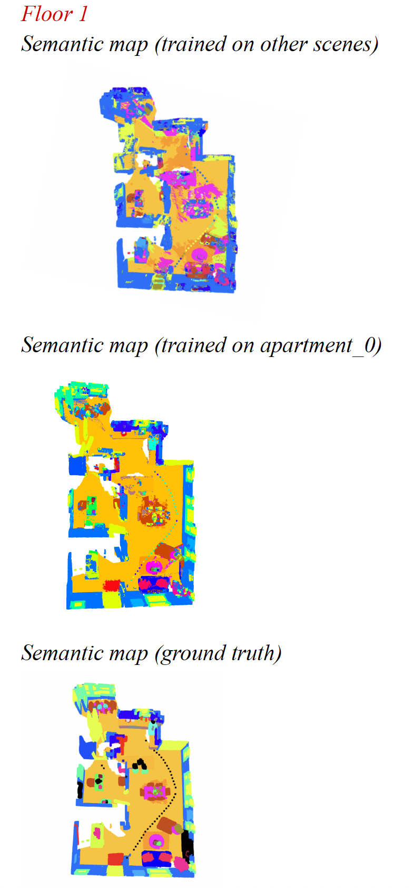
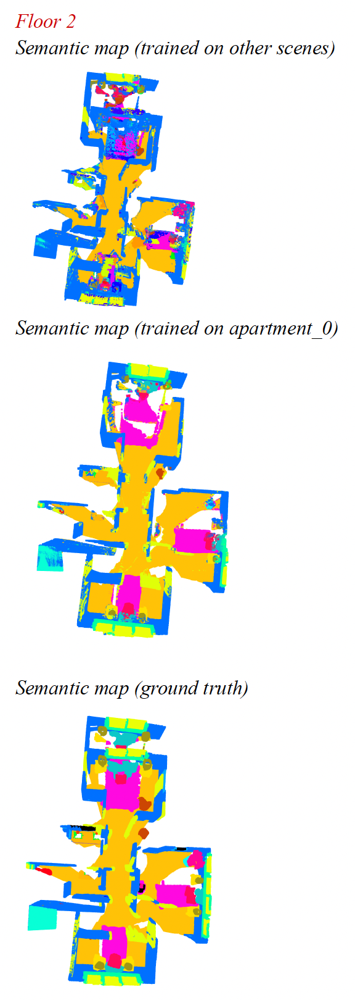

# pdm-f23-hw2

NYCU Perception and Decision Making 2023 Fall

Spec: [Google Docs](https://drive.google.com/file/d/1LdzOZnM4sa_z1dcEKYHdXxHH_FsDKr_h/view?usp=sharing)

## Preparation
In your original dpm-f23 directory, `git pull` to get new `hw2` directory. 

If you want to use [semantic-segmentation-pytorch](https://github.com/CSAILVision/semantic-segmentation-pytorch), you may face the problem that the page of pretrain model are not accessible.
Please check the [issue](https://github.com/CSAILVision/semantic-segmentation-pytorch/issues/286) and follow the step here to download model checkpoints in the same way.

**1. ade20k-mobilenetv2dilated-c1_deepsup** 
```
wget http://sceneparsing.csail.mit.edu/model/pytorch/ade20k-mobilenetv2dilated-c1_deepsup/encoder_epoch_20.pth 
wget http://sceneparsing.csail.mit.edu/model/pytorch/ade20k-mobilenetv2dilated-c1_deepsup/decoder_epoch_20.pth
```

**2. ade20k-hrnetv2-c1** 
```
wget http://sceneparsing.csail.mit.edu/model/pytorch/ade20k-hrnetv2-c1/encoder_epoch_30.pth 
wget http://sceneparsing.csail.mit.edu/model/pytorch/ade20k-hrnetv2-c1/decoder_epoch_30.pth
```

**3. ade20k-resnet50dilated-ppm_deepsup** 
```
wget http://sceneparsing.csail.mit.edu/model/pytorch/ade20k-resnet50dilated-ppm_deepsup/encoder_epoch_20.pth 
wget http://sceneparsing.csail.mit.edu/model/pytorch/ade20k-resnet50dilated-ppm_deepsup/decoder_epoch_20.pth
```

---
***Please star or tag, if you refer to my implementations.***

## Quick Start
#### Task1
##### Get dataset1, dataset2 for training
```
# In hw2/
python data_generator.py --dataset replica_v1/ --output dataset1
cp -r dataset1 semantic-segmentation-pytorch/data

python data_generator.py --dataset replica_v1/ --output dataset2
cp -r dataset2 semantic-segmentation-pytorch/data
```

##### Get .odgt file for training
```
# In hw2/semantic-segmentation-pytorch
cd semantic-segmentation-pytorch
python to_odgt.py --dataset 1
python to_odgt.py --dataset 2

```

##### Training for dataset1, dataset2
```
# In hw2/semantic-segmentation-pytorch
python3 train.py --gpus 0 --cfg config/ade20k-mobilenetv2dilated-c1_deepsup_dataset1.yaml

python3 train.py --gpus 0 --cfg config/ade20k-mobilenetv2dilated-c1_deepsup_dataset2.yaml
cd ..
```

##### Change HW1 floor1/floor2 data from sementics to annotaions for eval
```
# In hw2/
python data_generator_loadpose.py --dataset replica_v1/ --output first_floor

python data_generator_loadpose.py --dataset replica_v1/ --output second_floor
```

##### get .odgt for eval
```
# In hw2/semantic-segmentation-pytorch
cd semantic-segmentation-pytorch
python to_odgt_for_eval.py --floor first_floor
python to_odgt_for_eval.py --floor second_floor
```

##### Run eval_miltipro.py to evaluate the images you collected for HW1 for reconstruction

```
# In hw2/semantic-segmentation-pytorch

python3 eval_multipro.py --gpus 0 --cfg config/ade20k-mobilenetv2dilated-c1_deepsup_dataset1_floor1.yaml --result floor1

python3 eval_multipro.py --gpus 0 --cfg config/ade20k-mobilenetv2dilated-c1_deepsup_dataset1_floor2.yaml --result floor2


python3 eval_multipro.py --gpus 0 --cfg config/ade20k-mobilenetv2dilated-c1_deepsup_dataset2_floor1.yaml --result floor1

python3 eval_multipro.py --gpus 0 --cfg config/ade20k-mobilenetv2dilated-c1_deepsup_dataset2_floor2.yaml --result floor2

# the floor1/floor2 data could be found in 
# ckpt/ade20k-mobilenetv2dilated-c1_deepsup_dataset1/floor1
# ckpt/ade20k-mobilenetv2dilated-c1_deepsup_dataset1/floor2
# ckpt/ade20k-mobilenetv2dilated-c1_deepsup_dataset2/floor1
# ckpt/ade20k-mobilenetv2dilated-c1_deepsup_dataset2/floor2
```

#### Task2

##### Run 3d semantic reconstruction
```
# copy the above data store in hw2/data_collection/dataset1/floor1
# copy the above data store in hw2/data_collection/dataset1/floor2
# copy the above data store in hw2/data_collection/dataset2/floor1
# copy the above data store in hw2/data_collection/dataset2/floor2

# run g.t.
python 3d_semantic_map.py -d 1 -f 1 --seg_gt 
python 3d_semantic_map.py -d 1 -f 2 --seg_gt

# run floor1/2 for dataset1/2
python 3d_semantic_map.py -d 1 -f 1 --seg_gt False
python 3d_semantic_map.py -d 1 -f 2 --seg_gt False
python 3d_semantic_map.py -d 2 -f 1 --seg_gt False
python 3d_semantic_map.py -d 2 -f 2 --seg_gt False
```

---

## Results
#### Task1



#### Task2

  

