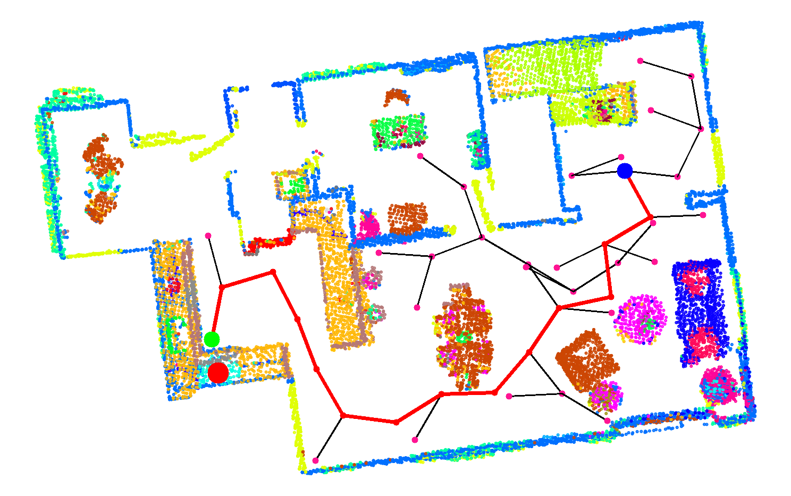
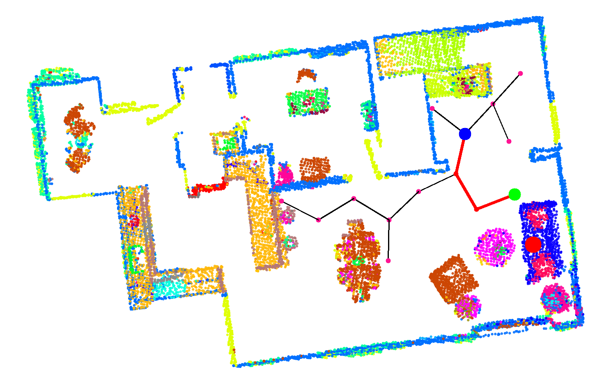
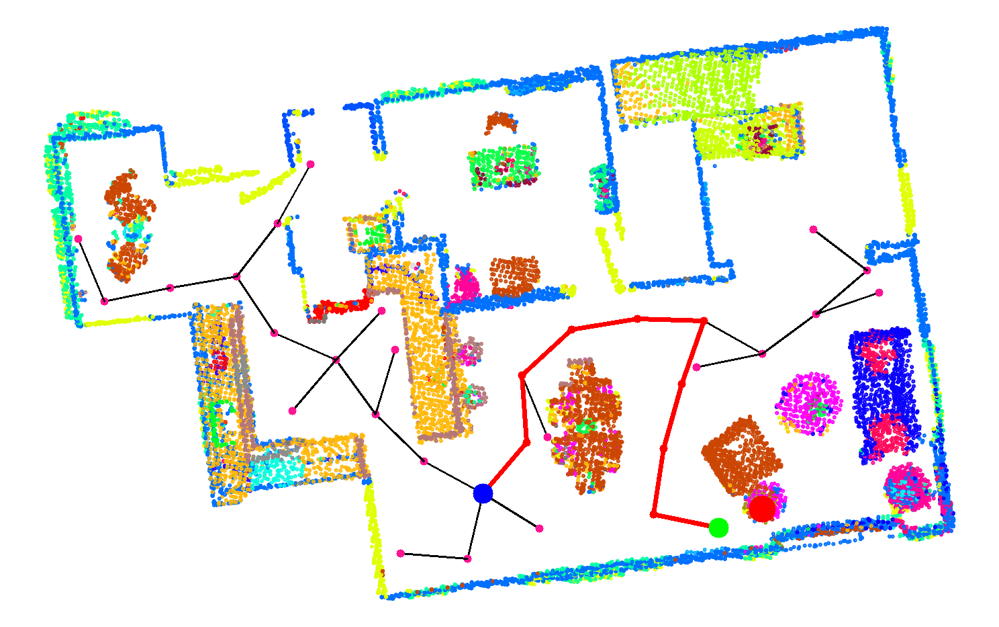
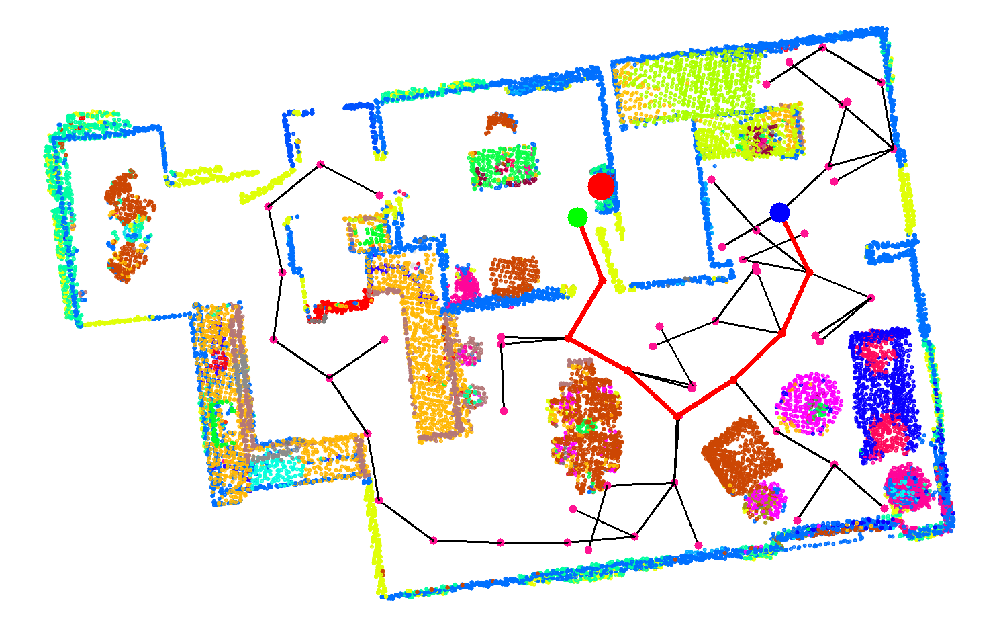
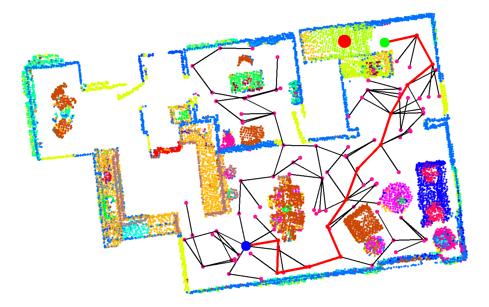

# pdm-f23-hw
NYCU Perception and Decision Making 2023 Fall

Spec: [Google Docs](https://docs.google.com/document/d/10vEbFE372HeNocKmyQws_-5Dff27dhH60boNyF-QqMk/edit?usp=sharing)

## Preparation
In your original dpm-f23 directory, `git pull` to get new `hw3` directory.

---
***Please star or tag this repo, if you refer to my implementations.***
## Quick Start
```
python load-2.py
# choose a start poiny and press enter
```

---

## Results
#### Task1: RRT path planning
***cooktop***
 

***cushion***
 

***lamp***
 

***rack***
 

***stair***


#### Task2: Robot Navigation
***cooktop and rack***
 


